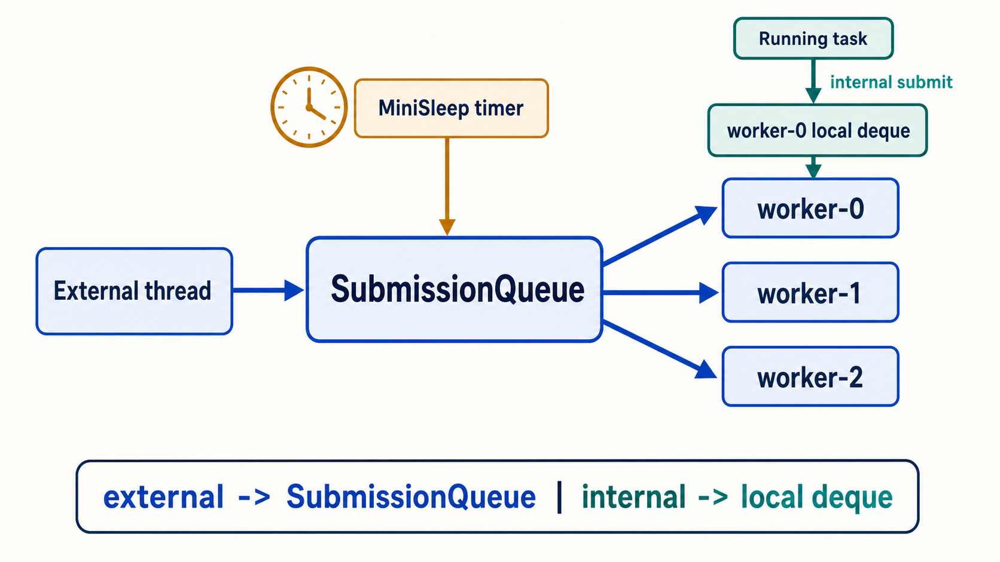
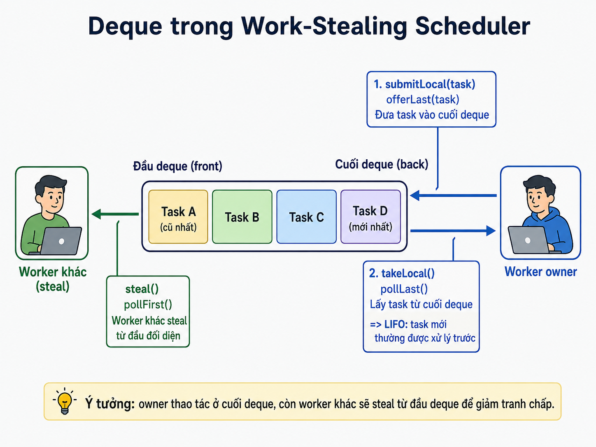

# Submission Queue: Nối Thế Giới Bên Ngoài Vào Work Stealing

Step trước đã có local deque và work stealing: worker ưu tiên việc của chính mình, hết việc thì lấy từ worker khác.

Nhưng còn một câu hỏi quan trọng:

> Nếu task đến từ `main`, timer, I/O completion, hay một callback bên ngoài scheduler thì nó đi vào đâu?

Step này trả lời câu hỏi đó bằng `SubmissionQueue`.



## Cầu Nối Từ Step Trước

Ở `workstealing.localqueue`, demo cố ý đưa toàn bộ task đầu tiên vào `worker-0`. Cách đó rất tốt để thấy deque và stealing, nhưng không mô tả nguồn việc ngoài scheduler.

Scheduler thực tế nhận việc từ hai thế giới khác nhau:

```text
outside worker                      inside a scheduler worker
main / timer / callback             task currently running
        |                                      |
        v                                      v
SubmissionQueue                         local deque
```

Điểm mới của step này không phải thay đổi cách steal. Nó là **routing tại thời điểm submit**.

## Hai Đường Submit

`WorkerContext` dùng `ThreadLocal` để nhận ra thread hiện tại có phải worker của scheduler hay không.

```java
WorkStealingWorker currentWorker = workerContext.current();

if (currentWorker != null) {
    currentWorker.submitLocal(task); // internal submission
} else {
    submissionQueue.submit(task);    // external submission
}
```

| Nơi gọi `submit()` | Đường đi | Lý do |
| --- | --- | --- |
| `main` thread | `SubmissionQueue` | Không thuộc worker nào |
| timer thread của `MiniSleep` | `SubmissionQueue` | Timer là nguồn việc bên ngoài |
| Task đang chạy trên `carrier-N` | Local deque của worker đó | Giữ locality cho work vừa sinh ra |

`SubmissionQueue` là hàng đợi chung, thread-safe, dùng cho việc mới đi vào scheduler. Local deque vẫn là nơi tối ưu cho work sinh ra trong lúc một worker đang chạy.

## Worker Chọn Việc Theo Thứ Tự Nào?

Mỗi worker lặp theo thứ tự:

```text
1. local deque của chính mình       -> locality, LIFO
2. SubmissionQueue                  -> nhận external work
3. local deque của worker khác      -> steal khi idle
4. chưa có việc                     -> Thread.sleep(1) tạm thời
```

Thứ tự này làm rõ hai vai trò khác nhau:

- Local deque giữ task gần worker đã sinh ra nó.
- `SubmissionQueue` là cổng vào chung cho các nguồn ngoài scheduler.



## Timeline Của Demo

`Main` submit `ExampleTask` từ main thread. Do đó task đầu tiên bắt đầu ở `SubmissionQueue`.

```text
main
  | submit(exampleTask)
  v
SubmissionQueue
  | worker bất kỳ poll()
  v
ExampleTask / STEP 1
  | submit(childTask) từ bên trong carrier worker
  +--------------------------------------> local deque của worker hiện tại
  |
  | MiniSleep.sleep(this, 1_000)
  v
timer thread hết 1 giây
  | submit(exampleTask) từ ngoài worker
  v
SubmissionQueue
  | worker bất kỳ poll()
  v
ExampleTask / STEP 2
```

Child task có thể bị worker khác steal ngay sau khi được enqueue. Điều đó không làm mất ý nghĩa của demo: tại **thời điểm submit**, child task đã đi vào local deque; work stealing là bước xảy ra sau đó khi một worker rảnh.

## Chạy Demo

Từ root của repository:

```bash
javac -d out $(find virtual-thread/src -name '*.java')
java -cp out virtualthread.workstealing.submissionqueue.Main
```

Các marker cần quan sát:

```text
[SUBMISSION] example-task -> global queue
[LOCAL] <child-task> -> worker-N
[TEAL] worker-M steals <child-task> from worker-N
example-task - STEP 2 runs on carrier-M
```

`[LOCAL]` chứng minh internal submission; `[SUBMISSION]` đầu tiên và lần sau timer wake chứng minh external submission; `[TEAL]` cho thấy cơ chế ở step trước vẫn hoạt động trên local deque.

## Những Thứ Cố Ý Chưa Làm

Phiên bản này không cố mô phỏng đầy đủ JVM:

- `Thread.sleep(1)` vẫn là polling đơn giản khi worker idle.
- `MiniSleep` tạo một timer thread cho mỗi lần sleep.
- Chưa có timer queue.
- Chưa có `park/unpark`.
- Chưa có worker signaling.
- Chưa có error policy hoàn chỉnh cho task exception.
- Chưa có nhiều submission queue hoặc cơ chế giảm contention cho external submit.
- Chưa có continuation thật để giữ Java stack.
- `VirtualTask` vẫn phải tự viết state machine.

Đây là giới hạn có chủ đích. Step hiện tại chỉ cần chứng minh ba điều:

1. External task đi vào `SubmissionQueue`.
2. Internal task đi vào local deque.
3. Timer của `MiniSleep` submit continuation trở lại bằng đường external.

## Bước Kế Tiếp

`Thread.sleep(1)` có nghĩa worker phải tự thức dậy định kỳ để kiểm tra queue. Bước kế tiếp hợp lý là `park/unpark` **cùng worker signaling**:

```text
external submit / internal submit
            |
            v
      signal một worker idle
            |
            v
      worker được unpark và lấy task
```

Không nên chỉ thay `sleep` bằng `park`: nếu không có signaling, một worker có thể vẫn ngủ dù queue đã có task. Giữ phần này ở step sau giúp step hiện tại chỉ tập trung vào câu hỏi quan trọng nhất: **task đi vào scheduler bằng đường nào?**
